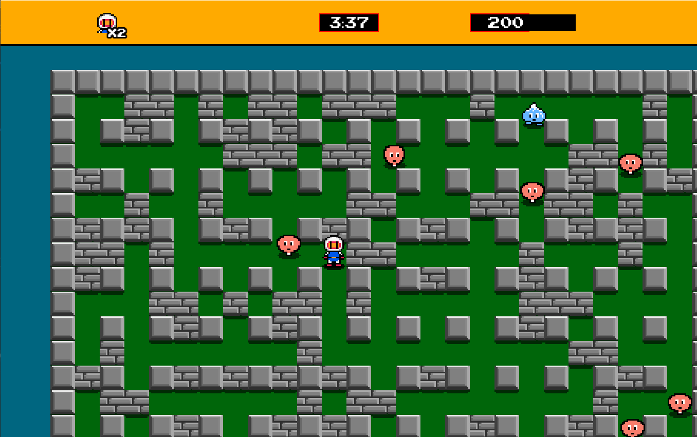
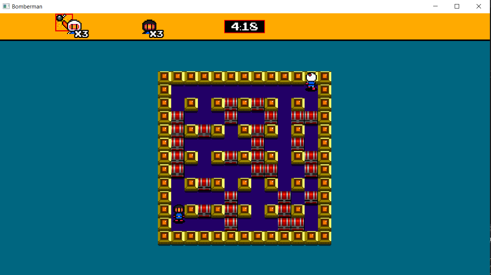
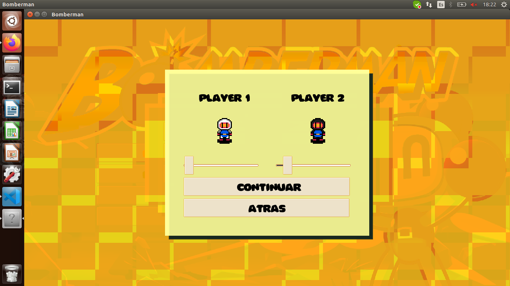

# BombermanRemake
Bomberman remake with the SFML library. Made from scratch in C++. Can be compiled in Windows and Linux. 

This project was made for Videogames subject in [Universidad de Zaragoza](http://www.unizar.es/). Educational use only.





## Features
* Local Multiplayer
* Enemies IA
* Players IA
* Versus Mode
* Story Mode

## Getting started
For linux need SFML libraries.

```bash
mkdir build
cd build
cmake ..
make
./Videogames
```

## Interest sites
- [Videojuegos Unizar](https://webdiis.unizar.es/asignaturas/videojuegos/)